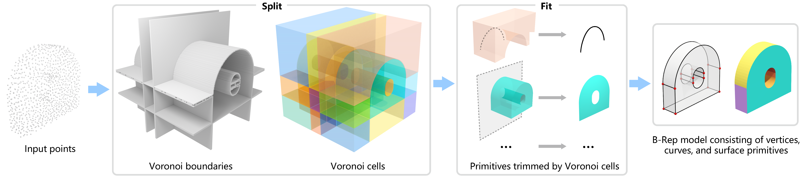

# NVDNet

[[Paper](https://arxiv.org/abs/2406.05261)] [[Video](https://youtu.be/omS38sAbt9w)]

Official implementation of [Split-and-Fit: Learning B-Reps via Structure-Aware Voronoi Partitioning](https://arxiv.org/abs/2406.05261) from [Yilin Liu](https://yilinliu77.github.io/), Jiale Chen, Shanshan Pan, [Daniel Cohen-Or](https://danielcohenor.com/), [Hao Zhang](https://www.cs.sfu.ca/~haoz/) and [Hui Huang](https://vcc.tech/~huihuang).



https://github.com/yilinliu77/NVDNet/assets/25240333/9544b3e2-86a9-4692-8cef-cc506479465e

[Full demo here](https://youtu.be/omS38sAbt9w)

# Citation
```
@article {liu_sig24,
  author = {Yilin Liu and Jiale Chen and Shanshan Pan and Daniel Cohen-Or and Hao Zhang and Hui Huang},
  title = {{Split-and-Fit}: Learning {B-Reps} via Structure-Aware {Voronoi} Partitioning},
  journal = {ACM Transactions on Graphics (Proc. of SIGGRAPH)},
  volume = {43},
  number = {4},
  pages = {108:1--108:13},
  year = {2024}
}
```

# Install

We provide two options for installing NVDNet: packed docker container and manual. We recommend using a packed docker container for ease of use.

## Option 1: Packed Docker Container (Recommended)

Download the packed docker container including the pre-compiled environment and sample data from [here](https://www.dropbox.com/scl/fi/p5zi97igmiygv2x69row7/NVD.tar?rlkey=l5o7hx5qu1zymxd7k4wln1pfq&st=sh5fjmfk&dl=0) (~30GB) and load it using the following command:

```
cat NVD.tar | docker import - nvd_release:v0
```

Run the container using the following command:

```
docker run -it --shm-size 64g --gpus all --rm --name nvdnet nvd_release:v0 /bin/zsh
```

If you want to connect to the container using an SSH, please refer to the `docker/Dockerfile` to create an `SSH` wrap. The default user and password is `root:root`.

## Option 2: Dockerfile

```bash
cd docker && docker build -t nvdnet .

docker run -it --rm --gpus all --name nvdnet -v /path/to/your/data:/mnt/d/ nvdnet
```

## Option 3: Manual

Please refer to `Dockerfile`, `install.sh` and `install_python.sh` for manual installation. This script has been tested on Ubuntu 22.04 with CUDA 11.8.0.

# Usage

## Inference (Single point cloud)

Download the weights from [here](https://www.dropbox.com/scl/fi/g6k2zwt2bbkk9y3vycrmo/0102_v15-_parsenet_unet_base16_focal75_wonormal_channel4_float32_aug.ckpt?rlkey=smryoqn52woonwhreo6l3oe1b&st=dbjvpsib&dl=0); the packed docker container has already included the weights.

Make sure you are using the latest version.

```
cd /root/NVDNet/build && git pull && make -j16
```


## Prepare data

Put your point cloud data (w/ or w/o normal) under `/data/poisson`. We provide two sample point clouds in that folder.

The input folder should be organized as follows:

```
- root
| - test_ids.txt (the list of your filenames)
| - poisson
| | - sample.ply (your point cloud here)
```

Replace the `/data` if you use your own data

```
export DATA_ROOT=/data
export ROOT_PATH=/root/NVDNet
```

### Generate UDF field using NDC

This step will generate the UDF field for the input point cloud using [NDC](https://github.com/czq142857/NDC). The output will be saved in `${DATA_ROOT}/feat/ndc`. 

Follow NDC's instructions if you are not using the packed container. You can speed up the process if you have multiple GPUs by replacing `1` with the number of GPUs you have. You can also use `CUDA_VISIBLE_DEVICES=x` to restrict the GPU usage.

```
cd ${ROOT_PATH} && python generate_test_voronoi_data.py ${DATA_ROOT} 1

${ROOT_PATH}/build/src/prepare_evaluate_gt_feature/prepare_evaluate_gt_feature ${DATA_ROOT}/ndc_mesh ${DATA_ROOT}/feat/ndc --resolution 256
```


### Voronoi prediction

This step will use NVDNet to predict the Voronoi diagram for the UDF field. The output Voronoi and the visualization will be saved in `${DATA_ROOT}/voronoi`. 

```
cd ${ROOT_PATH}/python && python test_model.py dataset.root=${DATA_ROOT} dataset.output_dir=${DATA_ROOT}/voronoi
```

### Primitive extraction

This step will extract the mesh from the Voronoi diagram. The output mesh will be saved in `${DATA_ROOT}/mesh`.

```
cd ${ROOT_PATH} && python scripts/extract_mesh_batched.py ${DATA_ROOT}/voronoi ${DATA_ROOT}/mesh ${DATA_ROOT}/test_ids.txt 
```

# Evaluation of the whole test set

Download the test data from [here](https://www.dropbox.com/scl/fi/sxhyd2x25tcpe8tp9cmko/NVD_test_data.zip?rlkey=zew313ul92i2wsmq82u8216f7&st=9as262cc&dl=0) and extract it to `/data` folder in your container. Ensure the folder `gt` is under `${DATA_PATH}`. 

Run the same steps as above to generate the final mesh for evaluation. Also, specify the correct `test_ids.txt` when generating the mesh.

Run the evaluation script to evaluate the results.

```
cd ${ROOT_PATH} && ./build/src/evaluate/evaluate ${DATA_ROOT}/mesh ${DATA_ROOT}/gt /tmp/test_metrics --chamfer --matched --dist -1
```


# Baselines (TODO)
We also provide the container and scripts to run [HPNet](https://github.com/SimingYan/HPNet), [SEDNet](https://github.com/yuanqili78/SED-Net), [ComplexGen](https://github.com/guohaoxiang/ComplexGen), as well as the [Point2CAD](https://github.com/YujiaLiu76/point2cad). Please refer to README.md in the `baselines` folder.

# Training

The data preparation and training code has already been provided in the `src` and `python` folders. However, since the Voronoi diagram is a volumetric representation, the whole dataset is too large (1.5TB) to be uploaded. We provide the code to generate the Voronoi diagram from the UDF field. You can use the code to generate the Voronoi diagram for your own data.

